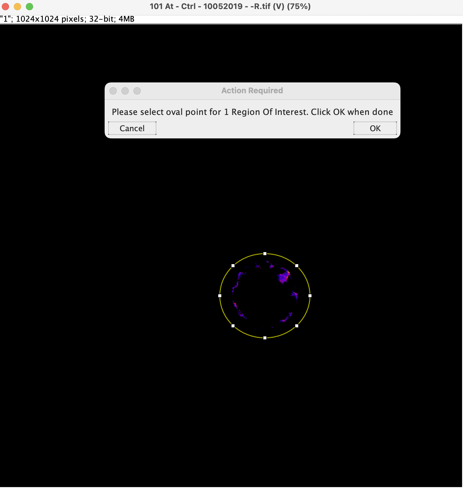

# Supporting Code used in the paper called "NERNST: a genetically-encoded ratiometric non-destructive sensing tool to estimate NADP(H) redox status in bacterial, plant and animal systems" 

For this paper, some images have been processed using Macros on [Fiji](https://imagej.net/software/fiji/). Other images have been processed with [CellProfiler](https://cellprofiler.org/), numeric data further processed using [KNIME](https://www.knime.com/) and plotted using [RStudio](https://www.rstudio.com/). This repository contains a code example used for the two different ways of image processing.

## Contents

- [Repository Contents](#repository-contents)
- [System Requirements](#system-requirements)
- [Pseudo Code](#pseudo-code)
- [Demo](#demo)
- [License](./LICENSE.md)

# Repository Contents

- [Macros](./Macros): Images taken with a Zeiss 8000 laser scanning confocal microscope or with Nikon Eclipse Ti with C2 Plus confocal laser scanning microscope were processed with Fiji (ImageJ) software. An example of the macros used for the processing are available on this folder.

- [CellProfiler](./CellProfiler): For experiments carried out in the PerkinElmer Operetta CLS confocal high-content imaging system, image analyses were performed with custom scripts and the CellProfiler image analysis software. The CellProfiler project file is included at the root of this folder.

    - [KNIME](./CellProfiler/KNIME/): KNIME was used to filter and sort the output from CellProfiler, generating a CSV file. A KNIME Workflow File is included in this folder.

    - [R-Graphs](./CellProfiler/R-Graphs): This folder contains two files that generate graphs. They can be run on [RStudio](https://www.rstudio.com/).
        - [R-Plots_Cyt.R](./CellProfiler/R-Graphs/R-Plots_Cyt.R): This file generates the graph shown on Figure 5e, based on the data obtained from the cytosol of the HeLa cells.
        - [R-Plots_Mito.R](./CellProfiler/R-Graphs/R-Plots_Mito.R): This file generates the graph shown on Figure 5f and Supplementary Figure 19, based on the data obtained from the mitochondria of the HeLa cells.

- [Demo](./Demo): Sample files for the [Demo section](#demo).

- [Docs](./Docs): Supporting files for rendering this README.

# System Requirements

## Hardware Requirements

For optimal performance, we recommend a computer with the following specs:

- RAM: 16+ GB  
- CPU: 4+ cores, 3.3+ GHz/core

## System Requirements

The following softwares are needed in order to run the code available on this repository.

### Fiji
Fiji is a distribution of ImageJ. It can be downloaded [here](https://imagej.net/software/fiji/downloads).

It is supported on the following systems:
- Windows XP, Vista, 7, 8, 10, 11, etc.
- Mac OS X 10.8 “Mountain Lion” or later
- Linux on amd64 and x86 architectures

**The Macros included on this repository are compatible with Windows, therefore it is highly recommended to use that Operating System.**

This source code has been tested on `Fiji - ImageJ 1.49m` and on `Fiji - ImageJ2 2.9.0/1.5.3t`. This takes between 1 and 5 minutes to install.

### CellProfiler
CellProfiler is a cell image analysis software. It can be downloaded [here](https://cellprofiler.org/releases).

It is supported on the following systems:
- Windows XP, Vista, 7, 8, 10, 11, etc.
- Mac OS X 10.15 “Catalina” or later

This source code has been tested on `CellProfiler 4.2.4`. This takes between 3 and 10 minutes to install.

### KNIME
KNIME Analytics Platform is an open source software for creating data science, which simplifies understanding data and designing data science workflows and reusable components. It can be downloaded [here](https://www.knime.com/downloads).

It is supported on the following systems:
- Windows Server 2016, 2019
- Ubuntu 16.04 LTS, 18.04 LTS, 20.04 LTS and derivatives
- RHEL/CentOS 7.x and 8

This source code has been tested on `KNIME 4.6.1`. This takes between 3 and 10 minutes to install.

### RStudio 
RStudio is an IDE for writing R. It can be downloaded [here](https://www.rstudio.com/products/rstudio/download/).

It is supported on the following systems:
- Windows 10/11
- Mac OS X 10.15 “Catalina” or later
- Ubuntu 18+/Debian 10+
- Fedora 19/Red Hat 7
- OpenSUSE 15

This source code has been tested on `RStudio 2022.07.1`. This takes between 1 and 5 minutes to install.

# Pseudo Code

## Processing Images with Fiji (ImageJ)

Images of the biosensor were analyzed using the Fiji software, unless otherwise stated. 

Raw data was exported to Fiji as 32-bit TIFF files and the complete field or a user’s defined Region of Interest (ROI), when indicated, were taken for analysis (Schwarzländer et al., 2008, J Microsc 231, 299, doi 10.1111/j.1365-2818.2008.02030.x; Fricker, 2015, Antioxid Redox Signal doi 10.1089/ars.2015.6390). 

Determinations of R values are corrected for background emission intensity by subtracting the intensity of an adjacent cell-free ROI and using the Otsu algorithm threshold to generate masks of positive expression. 

The corrected 405 nm fluorescence intensity image is divided by the corrected 488 nm fluorescence intensity image to produce a ratio image on a pixel by pixel basis through the command "Image Expression Parser". 

The grayscales of the ratio images are colored using the ImageJ look-up table ‘Fire’. 

The image analysis is automated through scripts we developed using ImageJ macros (found on [Macros](./Macros) folder). 

Data obtained from Fiji is imported, concatenated and prepared for analysis in [RStudio](http://www.rstudio.com/). Graphs are created in [GraphPad Prism 9 (GraphPad Software, Inc.)](https://www.graphpad.com/scientific-software/prism/).

In terms of processing time, it takes an average of one minute per image. As it has a series of manual steps, it may take longer, depending on human input.

## Processing Images with CellProfiler

Initially, the Images module compiles the list of files and folders to analyze. The Metadata module extracts information (metadata) describing the images. In the NamesAndTypes module, a meaningful name to each image by which other modules will refer to is assigned. 

The channel of 355-385 nm, which collects information from the lower excitation wavelength peak, was named “Sensor”.

The channel of 460-490 nm, which collects information from the higher excitation wavelength peak, was named “GFP”.

The ImageMath module combines the two channels to get a new image, to be used in the next two steps. 

In the IdentifyPrimaryObjects module, primary objects are segmented independently to identify each cell from the image created before. This information is stored in a file called “GFP_cells”, used in the next module, named MeasureObjectIntensity, which based on previously identified objects, measures the intensity of fluorescence on the “Sensor” and “GFP” channels. 

In the last module, the information from all the folders results in a .txt file that contains, among other data, the fluorescence intensity of the identified objects (cells) of each channel. This is exported into a spreadsheet to be later processed on KNIME.

In terms of processing time, it takes an average of one minute to analyze the sample input data provided.

On [KNIME](https://www.knime.com/), what is mainly done is the selection of columns of each channel required to calculate the R value of each cell.

Finally, this data is analysed and graphs are created on [RStudio](http://www.rstudio.com/).

# Demo

## Processing Images with Fiji

### Step by Step Guide
1. Open Fiji (more info on where to download it [here](#fiji))
2. On your local file system, create the following folder structure:
   - `Sample`
        - `Macros`
        - `ND2_images`

3. On the `ND2_images` folder created on the previous step, copy all the files of this repository included in [Demo/Fiji/Input/ND2_images](./Demo/Fiji/Input/ND2_images/). These are the input images taken with a Nikon Eclipse Ti with C2 Plus confocal laser scanning microscope.

4. On the `Macros` folder created on the 2nd step, copy all the files of this repository included in [Macros](./Macros). This is the logic that will process the images.

5. On Fiji, click on `Analyze / Set Measurements...` and make sure only `Mean gray value` is selected. Then click on `File / Open` and open the `mbatch.ijm` file that you copied into `Sample/Macros`. This will open a window displaying the content of the Macro. 

6. Click on `Run`. This will open a modal window asking to select a folder. Choose the `Sample` folder you have created on the 2nd step.

7. A new modal window will appear to set `Bio-Formats Import Options`. Make sure the following options are selected, and click on `OK`.

8. The first image of the batch will be displayed. On the modal window that indicates `About to process image: 1`, click on `OK`.

9. You will be prompted to select an oval point. Select an oval that only contains background, and then click on `OK`.

10. A modal window displaying information of the selected area will be displayed. If you're happy with the selection of this area, when the modal displaying `Keep going?` is displayed, uncheck it and click on `OK`. If it is not unchecked, you will be prompted to select a background area again.

11. A modal window asking to select `A` and `B` images will be displayed. `A` should represent the 405 nm channel, while `B` should represent the 488 nm channel. On the `A` drop down option, select `C1`. Click on `+`. This will display a drop down option for B. Select `C3` for `B`. On the `Expression` field, write `A/B` and then click on `Parse`. It will generate a `R Image`.

12. On the `Action Required` modal window, click on `Ok`. 

13. On the modal window for selecting `A` and `B` images, click on `Quit`. 

14. You will be prompted to select an oval point, this time it should include the cell. Select an oval that contains it, and then click on `OK`.

15. A modal window displaying information of the selected area will be displayed. If you're happy with the selection of this area, when the modal displaying `Keep going?` is displayed, uncheck it and click on `OK`. If it is not unchecked, you will be prompted to select the cell area again. If the image has several cells, then make sure `Keep going?` is selected in order to include them for processing, and repeat this process for as many cells of interest as present, using the oval point selector.

If there are several cells of interest present in a single image, selecting them all will look like this:

Steps 8 to 15 will be repeated for each of the remaining images included in the `Sample/ND2_images` folder. 
Once all the images have been processed, the modal windows will be closed and the last displayed window will be once again the one showing the Macro content.

### Results
When the Macros finish running on Fiji, 4 new folders will be added onto the `Sample` folder. You can see an example of them on [Demo/Fiji/Output](./Demo/Fiji/Output).

For each confocal microscopy file present in the `Sample` folder (in this example, files with extension `.nd2`), the following results will be obtained:
- `R_Images` folder: an R image obtained from processing saved in two formats, `.tiff` and `.jpg`.

- `Results_csv` folder: a comma separated values file (`.csv`) with the results obtained from the measurements made. In the first row, the R value of the total image is located, and in the successive rows you will find the R value corresponding to the measured cells of that image.

- `ROISets` folder: a `.zip` file containing selected ROIs. When opening this file in Fiji, ROI Manager will place them in the order obtained during the analysis. The first one will correspond to the ROI used to subtract the background, and the following ones will correspond to regions where the cells for which the R value has been obtained are found. Their value appears in the same order in the `Results_csv` folder.

- `Tiff` folder: contains the raw confocal images (in this case with `.nd2` extension) saved in `.tiff` format. The code is made so that the analysis is performed on the latter in order to avoid any risk of modifying the source data images.

## Processing Images with CellProfiler

### Step by Step Guide
1. On your local file system, create the following folder structure:
   - `Sample_CP`
        - `Images`

2. On the `Images` folder created on the previous step, copy all the files of this repository included in [Demo/CellProfiler/Input/Images](./Demo/CellProfiler/Input/Images/). These are the input images taken with a PerkinElmer Operetta CLS confocal high-content imaging system. 

3. On the `Sample_CP` folder created on the 1st step, copy the file [Pamela_CellProfiler_Analysis_combined.cpproj](./CellProfiler/Pamela_CellProfiler_Analysis_combined.cpproj) of this repository included in the [CellProfiler](./CellProfiler) folder. This is the custom script that will process the images.

4. Double click on this file. It will open the CellProfiler project with the pipeline ready to use.

5. Before incorporating the images to be analyzed, make sure to choose the `Sample_CP` folder created in the 1st step as the Output file location.

6. Drag and drop the `Images` folder containing the images copied in the 2nd step. Then, start the process by clicking on `Analyze Images`.

### Results
When the pipeline finishes running on CellProfiler, 3 new `.txt` files will be added onto the `Sample_CP` folder. You can see an example of them on [Demo/CellProfiler/Output](./Demo/CellProfiler/Output).

The files that contain the data to be processed with [KNIME-workflow](./CellProfiler/KNIME/Pamela_update_MB.knwf) and then plotted using [RStudio](https://www.rstudio.com/) are those ending with `..._cells`.
